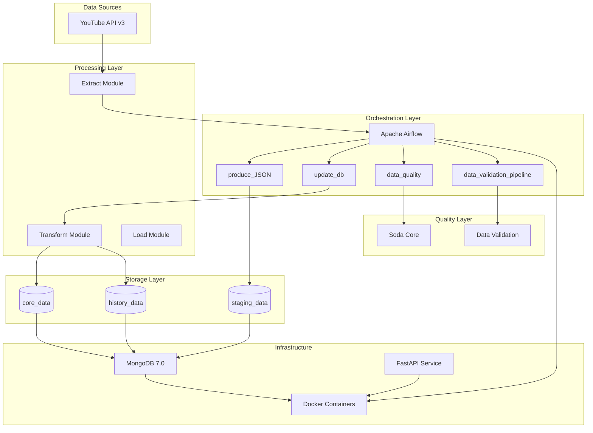
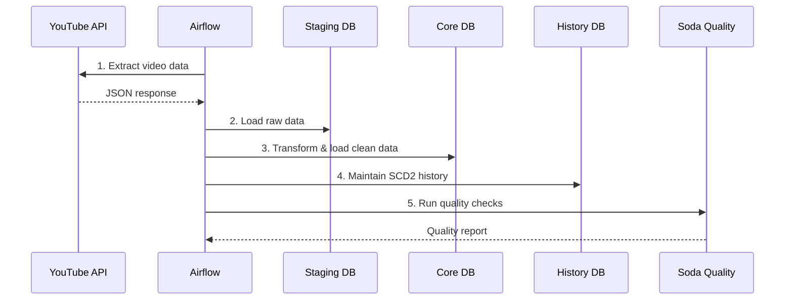

# 🎬 YouTube ELT Pipeline - Data Engineering Project

[](https://github.com/Saidouchrif/YouTube-ELT-Pipeline-Data-Engineering-/actions)
[](https://www.python.org/downloads/)
[](https://airflow.apache.org/)
[](https://www.mongodb.com/)

## 📋 Table des Matières

- [🎯 Vue d'ensemble](#-vue-densemble)
- [🏗️ Architecture du Système](#️-architecture-du-système)
- [🚀 Démarrage Rapide](#-démarrage-rapide)
- [📊 Pipelines de Données](#-pipelines-de-données)
- [🔧 Configuration](#-configuration)
- [🗄️ Modèle de Données](#️-modèle-de-données)
- [🔍 Qualité des Données](#-qualité-des-données)
- [🐳 Déploiement Docker](#-déploiement-docker)
- [🧪 Tests](#-tests)
- [📈 Monitoring](#-monitoring)
- [🔒 Sécurité](#-sécurité)
- [🤝 Contribution](#-contribution)

## 🎯 Vue d'ensemble

Pipeline ELT (Extract, Load, Transform) moderne et scalable pour l'extraction, la transformation et l'analyse des données YouTube. Ce projet implémente une architecture complète de data engineering avec :

- **Extraction automatisée** des données YouTube via l'API v3
- **Transformation et nettoyage** des données avec validation qualité
- **Stockage optimisé** dans MongoDB avec historisation SCD2
- **Orchestration robuste** avec Apache Airflow
- **Validation qualité** avec Soda Core
- **Infrastructure containerisée** avec Docker

### 🎯 Objectifs du Projet

- Extraire les métadonnées des vidéos YouTube (vues, likes, commentaires, etc.)
- Implémenter un pipeline de données scalable et maintenable
- Assurer la qualité des données avec des tests automatisés
- Fournir une architecture prête pour la production
- Démontrer les meilleures pratiques en data engineering

## 🏗️ Architecture du Système

### 📐 Diagramme d'Architecture



### 🔧 Composants Principaux

#### 1. **Couche d'Orchestration (Apache Airflow)**
- **produce_JSON.py** : Extraction des données YouTube → JSON timestampés
- **update_db.py** : Transformation staging → core + historisation
- **data_quality.py** : Tests qualité avec Soda Core
- **data_validation_pipeline.py** : Pipeline intégré avec alertes

#### 2. **Modules de Traitement (`plugins/youtube_elt/`)**
- **extract.py** : Extraction API YouTube avec gestion quotas
- **transform.py** : Nettoyage et standardisation des données
- **load.py** : Chargement MongoDB avec UPSERT
- **db.py** : Utilitaires de connexion MongoDB

#### 3. **Couche de Stockage (MongoDB)**
- **staging_data** : Données brutes extraites
- **core_data** : Données transformées et nettoyées
- **history_data** : Historisation SCD2 avec versioning

#### 4. **Validation Qualité (Soda Core)**
- Tests de complétude des données
- Validation des formats et types
- Détection des doublons
- Contrôles de cohérence métier

## 🚀 Démarrage Rapide

### 📋 Prérequis

- **Docker** 20.10+ et **Docker Compose** 2.0+
- **Python** 3.11+
- **Clé API YouTube Data v3** ([Obtenir une clé](https://developers.google.com/youtube/v3/getting-started))
- **Git** pour cloner le repository

### ⚡ Installation Express

#### Option 1: Script Automatique (Recommandé)
```powershell
# Windows PowerShell
.\start-project.ps1

# Pour arrêter le projet
.\stop-project.ps1
```

#### Option 2: Installation Manuelle
```bash
# 1. Cloner le repository
git clone https://github.com/Saidouchrif/YouTube-ELT-Pipeline-Data-Engineering-.git
cd YouTube-ELT-Pipeline-Data-Engineering-

# 2. Copier et configurer les variables d'environnement
cp .env.example .env
# Éditer .env avec votre clé API YouTube

# 3. Démarrer l'infrastructure complète
docker-compose -f docker-compose.final.yml up -d

# 4. Vérifier que tous les services sont actifs
docker-compose -f docker-compose.final.yml ps
```

### 🌐 Accès aux Services

| Service | URL | Credentials |
|---------|-----|-------------|
| **Airflow Web UI** | http://localhost:8080 | admin / admin |
| **MongoDB** | localhost:27017 | admin / password123 |
| **Mongo Express** | http://localhost:8081 | admin / admin123 |
| **FastAPI** | http://localhost:8000 | - |

## 📊 Pipelines de Données

### 🔄 Workflow Principal



### 📈 DAGs Disponibles

#### 1. **produce_JSON** - Extraction des Données
```python
# Fréquence: @daily
# Durée: ~2-5 minutes
# Quota API: ~100-500 unités
```
- Extraction via YouTube API v3
- Sauvegarde JSON timestampé
- Gestion automatique des quotas
- Retry logic intégré

#### 2. **update_db** - Transformation et Chargement
```python
# Fréquence: @daily (après produce_JSON)
# Durée: ~1-3 minutes
# Dépendances: staging_data
```
- Lecture des données staging
- Transformation et nettoyage
- Chargement avec UPSERT
- Historisation SCD2

#### 3. **data_quality** - Validation Qualité
```python
# Fréquence: @daily
# Durée: ~30 secondes
# Tests: 15+ règles qualité
```
- Tests de complétude
- Validation des formats
- Détection des anomalies
- Alertes automatiques

#### 4. **data_validation_pipeline** - Pipeline Intégré
```python
# Fréquence: @daily
# Durée: ~5-10 minutes
# Workflow: Validation → Transform → Load
```
- Pipeline bout-en-bout
- Validation préalable
- Arrêt sécurisé si échec
- Rapport consolidé

## 🔧 Configuration

### 🔐 Variables d'Environnement

Créez un fichier `.env` basé sur `.env.example` :

```bash
# YouTube API Configuration
YOUTUBE_API_KEY=votre_cle_api_youtube
YOUTUBE_CHANNEL_HANDLE=MrBeast
YOUTUBE_MAX_RESULTS=50
YOUTUBE_QUOTA_LIMIT=10000

# MongoDB Configuration
MONGO_HOST=mongodb
MONGO_PORT=27017
MONGO_USERNAME=admin
MONGO_PASSWORD=password123
MONGO_DATABASE=youtube_data

# Paths Configuration
DATA_STAGING_PATH=/data/staging/
DATA_PROCESSED_PATH=/data/processed/

# Retry Configuration
RETRY_ATTEMPTS=3
RETRY_DELAY=5

# Logging Configuration
LOG_LEVEL=INFO
LOG_FORMAT=json
```

### ⚙️ Configuration Avancée

#### Airflow Variables (Production)
```bash
# Via Airflow UI ou CLI
airflow variables set YOUTUBE_API_KEY "votre_cle_secrete"
airflow variables set YOUTUBE_CHANNEL_HANDLE "MrBeast"
airflow variables set YOUTUBE_MAX_RESULTS "100"
```

#### Soda Core Configuration
```yaml
# soda/checks/checks_mongo.yml
checks for staging_data:
  - row_count > 0
  - missing_count(video_id) = 0
  - duplicate_count(video_id) = 0

checks for core_data:
  - row_count > 0
  - missing_count(title) = 0
  - invalid_count(view_count) = 0:
      valid min: 0
```

## 🗄️ Modèle de Données

### 📊 Schéma des Collections

#### **staging_data** - Données Brutes
```json
{
  "_id": "ObjectId",
  "video_id": "dQw4w9WgXcQ",
  "title": "Never Gonna Give You Up",
  "description": "Official video...",
  "published_at": "2009-10-25T06:57:33Z",
  "duration": "PT3M33S",
  "view_count": 1400000000,
  "like_count": 15000000,
  "comment_count": 2800000,
  "thumbnail_url": "https://...",
  "channel_id": "UCuAXFkgsw1L7xaCfnd5JJOw",
  "channel_title": "Rick Astley",
  "tags": ["music", "80s"],
  "_ingested_at": "2025-01-01T12:00:00Z"
}
```

#### **core_data** - Données Transformées
```json
{
  "_id": "ObjectId",
  "video_id": "dQw4w9WgXcQ",
  "title": "Never Gonna Give You Up",
  "description": "Official video...",
  "published_at": "2009-10-25T06:57:33Z",
  "duration_seconds": 213,
  "view_count": 1400000000,
  "like_count": 15000000,
  "comment_count": 2800000,
  "thumbnail_url": "https://...",
  "channel_id": "UCuAXFkgsw1L7xaCfnd5JJOw",
  "channel_title": "Rick Astley",
  "tags": ["music", "80s"],
  "content_type": "standard",
  "created_at": "2025-01-01T12:00:00Z",
  "updated_at": "2025-01-01T12:00:00Z"
}
```

#### **history_data** - Historisation SCD2
```json
{
  "_id": "ObjectId",
  "video_id": "dQw4w9WgXcQ",
  "title": "Never Gonna Give You Up",
  "view_count": 1400000000,
  "like_count": 15000000,
  "comment_count": 2800000,
  "valid_from": "2025-01-01T12:00:00Z",
  "valid_to": null,
  "created_at": "2025-01-01T12:00:00Z",
  "updated_at": "2025-01-01T12:00:00Z"
}
```

### 🔍 Index MongoDB

```javascript
// Index pour performance
db.staging_data.createIndex({"video_id": 1}, {unique: true})
db.core_data.createIndex({"video_id": 1}, {unique: true})
db.history_data.createIndex({"video_id": 1, "valid_from": 1})

// Index pour requêtes temporelles
db.core_data.createIndex({"published_at": -1})
db.history_data.createIndex({"valid_from": -1, "valid_to": 1})
```

## 🔍 Qualité des Données

### 📋 Tests Automatisés

#### **Tests de Complétude**
- ✅ Présence des champs obligatoires
- ✅ Validation des types de données
- ✅ Contrôle des valeurs nulles
- ✅ Vérification des formats

#### **Tests de Cohérence**
- ✅ Valeurs numériques positives
- ✅ Formats de dates ISO 8601
- ✅ Longueurs de chaînes valides
- ✅ Relations entre champs

#### **Tests d'Unicité**
- ✅ Pas de doublons sur video_id
- ✅ Intégrité référentielle
- ✅ Contraintes métier

### 🚨 Alertes et Monitoring

```python
# Configuration des alertes
QUALITY_THRESHOLDS = {
    "min_records": 1,
    "max_null_percentage": 5,
    "max_duplicate_percentage": 0,
    "freshness_hours": 24
}

# Actions en cas d'échec
- Arrêt du pipeline
- Notification par email/Slack
- Logging détaillé
- Rollback automatique
```

## 🐳 Déploiement Docker

### 🏗️ Architecture des Conteneurs

```yaml
services:
  # Base de données
  mongodb:
    image: mongo:7.0
    ports: ["27017:27017"]
    
  # Interface MongoDB
  mongo-express:
    image: mongo-express:1.0.0
    ports: ["8081:8081"]
    
  # API FastAPI
  youtube-api:
    build: .
    ports: ["8000:8000"]
    
  # Orchestrateur Airflow
  airflow-standalone:
    image: apache/airflow:2.7.3-python3.11
    ports: ["8080:8080"]
```

### 🚀 Commandes de Déploiement

```bash
# Démarrage complet
docker-compose -f docker-compose.final.yml up -d

# Vérification des services
docker-compose -f docker-compose.final.yml ps

# Logs en temps réel
docker-compose -f docker-compose.final.yml logs -f

# Arrêt propre
docker-compose -f docker-compose.final.yml down

# Nettoyage complet (données incluses)
docker-compose -f docker-compose.final.yml down -v
```

### 🔧 Debugging

```bash
# Accès aux conteneurs
docker exec -it youtube_airflow bash
docker exec -it youtube_mongodb mongosh

# Vérification des logs
docker logs youtube_airflow --tail 100
docker logs youtube_mongodb --tail 50

# Test de connectivité
docker exec youtube_airflow python -c "from youtube_elt.db import get_mongo_client; print('MongoDB OK')"
```

### 🚨 Dépannage des Problèmes Courants

#### **Problème: Erreur d'installation Soda Core**
```bash
# Solution: Utiliser requirements-ci.txt pour CI/CD
pip install -r requirements-ci.txt

# Ou installer Soda Core séparément
pip install soda-core
```

#### **Problème: Conteneur Airflow ne démarre pas**
```bash
# Vérifier les logs
docker logs youtube_airflow

# Redémarrer le conteneur
docker-compose -f docker-compose.final.yml restart youtube_airflow
```

#### **Problème: MongoDB connection refused**
```bash
# Vérifier que MongoDB est démarré
docker-compose -f docker-compose.final.yml ps

# Redémarrer MongoDB
docker-compose -f docker-compose.final.yml restart mongodb
```

#### **Problème: API YouTube quota exceeded**
```bash
# Vérifier votre quota dans Google Cloud Console
# Ajuster YOUTUBE_MAX_RESULTS dans .env
# Modifier la fréquence des DAGs
```

## 🧪 Tests

### 🔬 Suite de Tests

```bash
# Installation des dépendances de test
pip install -r requirements.txt

# Exécution de tous les tests
pytest tests/ -v

# Tests avec couverture (CI/CD)
pytest tests/ --cov=plugins --cov-report=xml

# Tests spécifiques par module
pytest tests/test_extract.py -v     # Tests d'extraction
pytest tests/test_transform.py -v  # Tests de transformation
pytest tests/test_load.py -v       # Tests de chargement
pytest tests/test_db.py -v         # Tests de base de données
pytest tests/test_config.py -v     # Tests de configuration

# Tests par catégorie
pytest -m unit tests/              # Tests unitaires uniquement
pytest -m integration tests/       # Tests d'intégration uniquement
```

### 📊 Types de Tests

#### **Tests Unitaires** (20+ tests)
- Extraction API YouTube
- Transformation des données
- Chargement MongoDB
- Validation qualité

#### **Tests d'Intégration**
- Pipeline bout-en-bout
- Connectivité MongoDB
- API YouTube
- DAGs Airflow

#### **Tests de Performance**
- Temps d'exécution
- Utilisation mémoire
- Throughput données
- Quotas API

## 📈 Monitoring

### 📊 Métriques Clés

```python
# Métriques de performance
- Temps d'exécution des DAGs
- Nombre de vidéos traitées
- Taux de succès/échec
- Utilisation des quotas API

# Métriques de qualité
- Pourcentage de données valides
- Nombre d'anomalies détectées
- Fraîcheur des données
- Complétude des champs
```

### 🔔 Alertes Configurées

- **Échec de DAG** → Notification immédiate
- **Quota API épuisé** → Alerte préventive
- **Qualité dégradée** → Rapport détaillé
- **Panne service** → Escalade automatique

## 🔒 Sécurité

### 🛡️ Bonnes Pratiques

- **Secrets** stockés dans variables Airflow
- **Authentification** MongoDB avec utilisateur dédié
- **Chiffrement** des communications
- **Logs** sans données sensibles
- **Accès** restreint aux services

### 🔐 Configuration Sécurisée

```bash
# Variables sensibles (ne pas commiter)
YOUTUBE_API_KEY=secret
MONGO_PASSWORD=secret

# Utilisation de Docker secrets
docker secret create youtube_api_key api_key.txt
```

## 📁 Structure du Projet

```
YouTube-ELT-Pipeline-Data-Engineering-/
├── 📁 dags/                          # DAGs Airflow
│   ├── produce_JSON.py               # Extraction YouTube
│   ├── update_db.py                  # Transformation & Load
│   ├── data_quality.py               # Tests qualité
│   └── data_validation_pipeline.py   # Pipeline intégré
├── 📁 plugins/youtube_elt/           # Modules réutilisables
│   ├── extract.py                    # Extraction API
│   ├── transform.py                  # Transformation
│   ├── load.py                       # Chargement MongoDB
│   └── db.py                         # Utilitaires DB
├── 📁 config/                        # Configuration
│   ├── settings.py                   # Settings centralisés
│   └── soda_config.yml              # Config Soda Core
├── 📁 soda/checks/                   # Tests qualité
│   └── checks_mongo.yml             # Règles validation
├── 📁 data/staging/                  # Données temporaires
├── 📁 mongodb-init/                  # Scripts d'initialisation
│   └── init.js                      # Setup collections
├── 📁 Keys/                          # API et utilitaires
│   ├── Api/                         # FastAPI service
│   ├── Data/                        # Données d'exemple
│   └── quota_manager.py             # Gestion quotas
├── 🐳 docker-compose.final.yml       # Infrastructure Docker
├── 🐳 Dockerfile.airflow             # Image Airflow custom
├── 📋 requirements.txt               # Dépendances Python
├── ⚙️ .env.example                   # Template configuration
├── 🔧 astro.yaml                     # Config Astro CLI
└── 📖 README.md                      # Documentation
```

## 🤝 Contribution

### 🔄 Workflow de Développement

```bash
# 1. Fork et clone
git clone https://github.com/votre-username/YouTube-ELT-Pipeline-Data-Engineering-.git

# 2. Créer une branche
git checkout -b feature/nouvelle-fonctionnalite

# 3. Développer et tester
pytest tests/ -v

# 4. Commit et push
git commit -m "feat: ajouter nouvelle fonctionnalité"
git push origin feature/nouvelle-fonctionnalite

# 5. Créer une Pull Request
```

### 📝 Standards de Code

- **PEP 8** pour le style Python
- **Type hints** obligatoires
- **Docstrings** pour toutes les fonctions
- **Tests** pour toute nouvelle fonctionnalité
- **Logging** approprié

### 🐛 Signalement de Bugs

Utilisez les [GitHub Issues](https://github.com/Saidouchrif/YouTube-ELT-Pipeline-Data-Engineering-/issues) avec :
- Description détaillée
- Étapes de reproduction
- Logs d'erreur
- Environnement (OS, versions)

## 📞 Support

- **Documentation** : Ce README et commentaires dans le code
- **Issues** : [GitHub Issues](https://github.com/Saidouchrif/YouTube-ELT-Pipeline-Data-Engineering-/issues)
- **Discussions** : [GitHub Discussions](https://github.com/Saidouchrif/YouTube-ELT-Pipeline-Data-Engineering-/discussions)

## 📄 Licence

Ce projet est sous licence **MIT**. Voir le fichier [LICENSE](LICENSE) pour plus de détails.

---

<div align="center">

**🎬 YouTube ELT Pipeline - Data Engineering Project**

*Développé avec ❤️ pour la communauté data engineering*

[](https://github.com/Saidouchrif/YouTube-ELT-Pipeline-Data-Engineering-/stargazers)
[](https://github.com/Saidouchrif/YouTube-ELT-Pipeline-Data-Engineering-/network/members)

</div>
